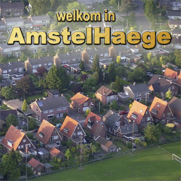

## Inleiding

Na jarenlang getouwtrek is de knoop eindelijk doorgehakt: er komt een nieuwe woonwijk in de Duivendrechtse polder, net ten noorden van Ouderkerk aan de Amstel. De huisjes zijn bedoeld voor het midden- en bovensegment van de markt, met name expats en hoogopgeleide werknemers actief op de Amsterdamse Zuidas.

Omdat de Duivenderechtse polder ooit beschermd natuurgebied was, is de compromis dat er alleen lage vrijstaande woningen komen, om zo toch het landelijk karakter te behouden. Dit, gecombineerd met een aantal strenge restricties ten aanzien van woningaanbod en het oppervlaktewater, maakt het een planologisch uitdagende klus. De gemeente overweegt drie varianten: de 20-huizenvariant, de 40-huizenvariant en de 60-huizenvariant. Er wordt aangenomen dat een huis meer waard wordt naarmate de vrijstand toeneemt, de rekenpercentages zijn per huistype vastgesteld.

## Requirements voor de wijk

1. De wijk komt te staan op een stuk land van 160x180 meter. Er wordt door de planologen gerekend in hele meters.
2. Het aantal woningen in de wijk bestaat voor 60% uit eengezinswoningen, 25% uit bungalows en 15% uit maisons. 
3. Een eengezinswoning is 8x8 meter (breed x diep) en heeft een waarde van E.285.000,- De woning heeft rondom twee meter vrijstand nodig; iedere meter extra levert een prijsverbetering op van 3%.
4. Een bungalow is 10x7.5 meter (breed x diep) en heeft een waarde van E.399.000,-. De woning heeft rondom drie meter vrijstand nodig, iedere meter extra levert een prijsverbetering op van 4%.
5. Een Maison is 11x10.5 meter (breed x diep) en heeft een waarde van E.610.000,- De woning heeft rondom zes meter vrijstand nodig, iedere  meter extra levert een prijsverbetering op van 6%.
6. De vrijstand van een woning is de kleinste afstand tot de dichtstbijzijnde andere woning in de wijk. Oftewel, voor een vrijstand van 6 meter moeten alle andere woningen in de wijk op minimaal 6 meter afstand staan. Deze afstand is bepaald als de kortste afstand tussen twee muren, dus niet vanuit het centrum van de woning.
7. De verplichte vrijstand voor iedere woning moet binnen de kaart vallen.
8. In geval van percentuele waardevermeerdering per meter is de toename niet cumulatief. Een maison met twee meter extra vrijstand is dus 12.0% meer waard, niet 12.36%.
9. De wijk moet voor 20% uit oppervlaktewater bestaan, opgedeeld in niet meer dan vier lichamen die rechthoekig of ovaal van vorm zijn. Om de wijk aantrekkelijk te houden, moeten de lichamen een hoogte-breedteverhoudingen tussen de 1 en de 4 liggen. Geen lange dunne slootjes dus! Het water kan niet onder de huizen door lopen.

## Opdracht

Lever een plattegrond (2D of 3D) af voor ieder van de drie huizenvarianten voor de nieuw te bouwen wijk Amstelhaege. De scores voor een plattegrond is de opgetelde waarde van alle huizen in de wijk.

## Advanced

* Wat is de maximale waarde die je kunt bereiken met een zelfgekozen verdeling van huizen? Wat de maximale vrijstand?

## Links

* Een moderne [nieuwbouwwijk](https://delubouw.nl/wp-content/uploads/2018/10/header-delubouw-1NIEUW.jpg)
