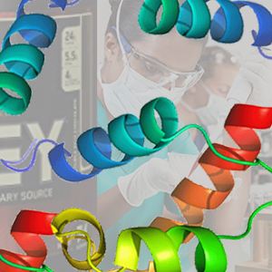
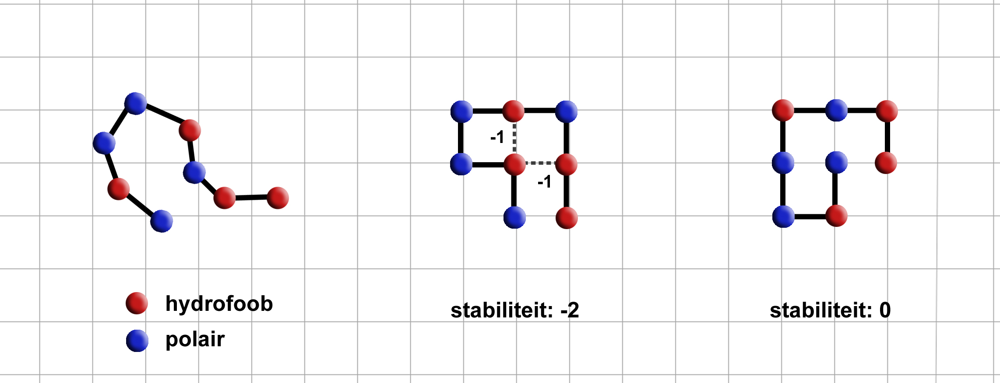

## Inleiding

Eiwitten zijn lange strengen van aminozuren die veel belangrijke processen in het menselijk lichaam beregelen. Het is bekend dat eiwitten 'opgevouwen' in de lichaamscellen opgeborgen zitten, en dat de specifieke vouwing bepalend is voor het functioneren; verkeerd gevouwen eiwitten staan aan de basis van onder andere kanker, Alzheimer en taaislijmziekte. Het is daarom van groot belang voor zowel de farmaceutische industrie als de medische wetenschap om iets te kunnen zeggen over de exacte vorm van de vouwing.

Nu is er is het één en ander bekend over het mechanisme: hydrofobe aminozuren (H) willen graag 'naast elkaar' liggen, polaire aminozuren (P) hebben die voorkeur niet. Als twee hydrofobe aminozuren naast elkaar liggen ontstaat er namelijk een 'H-bond' door de aantrekkende kachten tussen de twee. En hoe meer bonds, hoe stabieler het eiwit. Voor de wetenschappers en farmaceuten is het belangrijk om te weten tot welke stabiliteit van het eiwit maximaal gevouwen zou kunnen worden. Het doel is dus de gegeven eiwitten zo op te vouwen, dat ze zo stabiel mogelijk zijn.

**Links:** een eiwit van vier polaire en vier hydrofobe aminozuren. **Midden:** een relatief stabiele vouwing met twee H-bonds. **Rechts:** een onstabiele vouwing vanwege het ontbreken van H-bonds.

Om de boel enigzins beheersbaar te houden gaan we uit van een 2D grid waarbij we ieder aminozuur op een gridpunt komt te liggen. Het volgende aminozuur ligt op één van de aangrenzende gridpunten waardoor we eiwitten 'gevouwen' kunnen neerleggen, met hoeken van telkens 90 graden. Als twee H's naast elkaar op het grid liggen krijgt het totale eiwit een -1 op de score. Hoe lager de score, hoe stabieler het eiwit.

## Opdracht

1. Schrijf een algoritme dat het eiwit HHPHHHPH zo goed mogelijk vouwt. Probeer ook te kwantificeren ''hoe goed'' de vouwing is.

2. Vouw de volgende eiwitten zo goed mogelijk. Ze zijn langer, maar zijn ze ook moeilijker?

    * HHPHHHPHPHHHPH 

    * HPHPPHHPHPPHPHHPPHPH

    * PPPHHPPHHPPPPPHHHHHHHPPHHPPPPHHPPHPP

    * HHPHPHPHPHHHHPHPPPHPPPHPPPPHPPPHPPPHPHHHHPHPHPHPHH 

3. Het aminozuur Cysteine (C) heeft hele sterke bonds. Als twee Cysteine-aminozuren naast elkaar liggen krijgt het eiwit -5 op de score. Tussen C's en H's is de score -1, en met P's is er geen bindingseffect, dus score nul. Bepaal de beste vouwing.

    * PPCHHPPCHPPPPCHHHHCHHPPHHPPPPHHPPHPP

    * CPPCHPPCHPPCPPHHHHHHCCPCHPPCPCHPPHPC

    * HCPHPCPHPCHCHPHPPPHPPPHPPPPHPCPHPPPHPHHHCCHCHCHCHH

    * HCPHPHPHCHHHHPCCPPHPPPHPPPPCPPPHPPPHPHHHHCHPHPHPHH 

## Advanced

{:start="4"}
4. Voeg een dimensie toe. Vouw de eiwitten zo goed mogelijk in 3D.

## Output

Om resultaten te kunnen verifiëren is het handig om in een uniform format je output te genereren. 
Bekijk [het voorbeeld](example_output.csv) en zorg ervoor dat jouw programma een oplossing in hetzelfde format kan omzetten.
De 0 bij het laatste aminozuur geeft aan dat er geen buiging gedaan hoeft te worden.

Deze output is gebaseerd op het format zoals bedacht door Bas Terwijn: 

""
Here:
  "1" means a positive step in the first  dimension (X-axis direction).
 "-1" means a negative step in the first  dimension (X-axis direction).
  "2" means a positive step in the second dimension (Y-axis direction).
 "-2" means a negative step in the second dimension (Y-axis direction).
  "3" means a positive step in the third  dimension (Z-axis direction).
  etc...
Steps can go up to arbitrary dimensions.

This example file will be interpreted as follows. We start with the
first element of the protein 'H':

               H

The first step is 1, so we make a step in the positive X direction
and place the next element 'H':

               H-H

The next step is 2, so we make a step in the positive Y direction
and place the next element 'P':

                 P
                 |
               H-H

The next step is -1, so we make a step in the negative X direction
and place the next element 'H':

               H-P
                 |
               H-H

The remaining steps result in:

             P-H-P
                 |
               H-H

             P
             |
             P-H-P
                 |
               H-H

             P
             |
             P
             |
             P-H-P
                 |
               H-H

             P-P
             |
             P
             |
             P-H-P
                 |
               H-H

             P-P
             | |
             P H
             |
             P-H-P
                 |
               H-H

The score is the number of pairs of neighboring 'H' elements that
are not neighbors in the elements list in the first line of this
file indicated here by the two '*' characters:

             P-P
             | |
             P H
             | *
             P-H-P
               * |
               H-H

Therefore the score of the folded protein described by this file is: 2  
""

N.B. Je programma hoeft hier verder niets mee te doen. Het programma hoeft dit enkel als laatste stap in het process te kunnen doen.

## Links & Trivia

De eerste versie van deze case is ontwikkeld door Misha Paauw en Anneliek ter Horst in het kader van Advanced Heuristics, januari 2017.