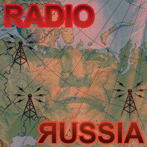
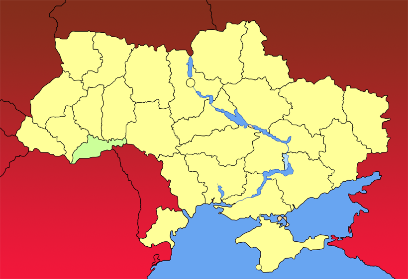
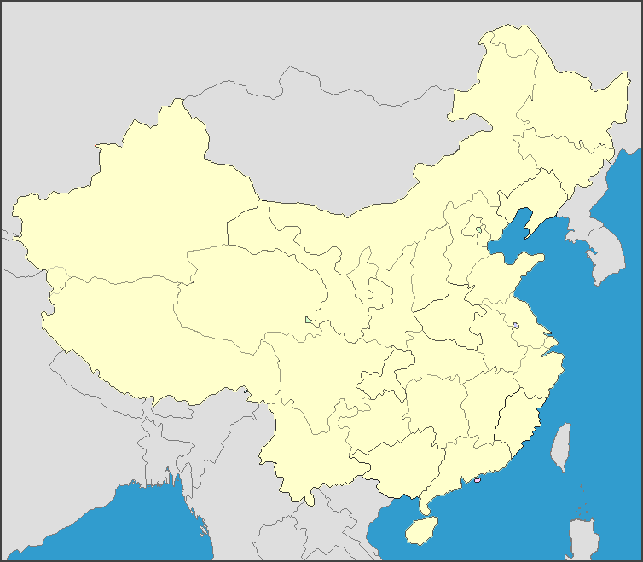

## Inleiding

De russische overheid wil een goede verdeling van zendfrequenties. Er zijn precies zeven types zendmasten beschikbaar, voor het moment bekend als type A t/m type G. Voor een goede verdeling is het noodzakelijk dat twee aangrenzende provincies niet dezelfde zendertypes hebben. Omdat wiskundigen van de russische overheid de details van de optimale oplossing niet precies kennen hebben ze ook wat kaarten van kleinere landen ter hand genomen, in de hoop het probleem wat beter te gaan begrijpen en tot een goede oplossing te komen.

## Opdracht 1

1. Verzin een zenderinrichting voor de Oekraïne. Iedere provincie moet een zendertype hebben, geen enkele twee aangrenzende provincies mogen hetzelfde zendertype hebben. Verzin een zenderinrichting voor het hele land, en hoe minder zendertypes je gebruikt, hoe beter.

2. Doe hetzelfde voor China, de USA en uiteindelijk voor moedertje Rusland. Hoe minder zenderypes, hoe beter.

3. De produktie van zenders wordt in Rusland uiteraard ook door de overheid beregeld. Het is het goedkoper om minder zendertypes te hebben, maar ook om van alle zendertypes ongeveer evenveel te hebben. Probeer voor ieder land met ieder minimumaantal zendertypes te bepalen hoe een evenwichtige verdeling eruit zou zien, en kijk of een inrichting mogelijk is met zo'n verdeling.

| Oekraïne | USA |
| --- | --- |
|  |  |

| China | Russia |
| --- | --- |
|  |  |

## Opdracht 2

Er zijn vier mogelijke kostenschema's bekend geworden. Bekijk voor ieder land welk kostenschema de voordeligste inrichting oplevert.

| Zendertype | Kosten 1 | Kosten 2 | Kosten 3 | Kosten 4 |
| --- | --- | --- | --- | --- |
| A | 12 | 19 | 16 | 3 |
| B | 26 | 20 | 17 | 34 |
| C | 27 | 21 | 31 | 36 |
| D | 30 | 23 | 33 | 39 |
| E | 37 | 36 | 36 | 41 |
| F | 39 | 37 | 56 | 43 |
| G | 41 | 38 | 57 | 58 |

## Advanced

Omdat production in numbers goedkoper is, wordt iedere geplaatste zender van een type 10% goedkoper dan de vorige van hetzelfde type. Vind, met je algoritmes, opnieuw de beste oplossing voor de landen. Hoe vergelijken ze met de oplossingen van opgaven 1 en 2?
