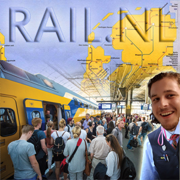

# Case: RailNL

{:.inline}

Een dienstregeling voor treinverkeer bestaat eigenlijk uit vier planningsonderdelen: 

1. De lijnvoering: Wat zijn de trajecten waarover de treinen gedurende de dag heen en weer rijden?
2. De dienstregeling: hoe laat vertrekken de treinen van de stations over de trajecten?
3. Het materieelrooster: welk treinstel en welke wagons zijn op welk moment op welke plaats?
4. Het personeelsrooster: zijn alle treinen bemand door tenminste één bestuurder en twee conducteurs?

Deze case gaat over het eerste deel, het maken van de lijnvoering. Meer specifiek: over de lijnvoering van intercitytreinen. Dat betekent dat je binnen een gegeven tijdsframe een aantal trajecten uitzet. Een traject is een route van sporen en stations waarover treinen heen en weer rijden. Een traject mag niet langer zijn dan het opgegeven tijdsframe.

**Voorbeeld**: Het traject [Castricum , Zaandam , Hoorn , Alkmaar] is een traject met een duur van 59 minuten, en zou dus binnen het tijdseframe van een uur passen.

## Opdracht deel 1: Noord- en Zuid-Holland

In de provincies Noord- en Zuid-Holland liggen in totaal 118 treinstations, waarvan de 22 belangrijkste intercitystations met de tussenliggende spoorverbindingen, in een [.csv-bestand](ConnectiesHolland.csv) zijn opgeslagen. De getallen die achter een verbinding staan zijn de reistijden in minuten.

1. Maak een lijnvoering voor Noord-Holland met maximaal zeven trajecten binnen een tijdsframe van twee uur, waarbij alle verbindingen bereden worden.

RailNL heeft recentelijk een doelfunctie opgesteld voor de kwaliteit van de lijnvoering. Als 100% van van de verbindingen bereden wordt, levert dat 10000 punten op je lijnvoering op, anders krijg je een een gedeelte daarvan. Maar hoe minder trajecten voor dezelfde service, hoe goedkoper. En in hoe minder tijd er in al die trajecten samen verbruikt wordt, hoe beter. Dus die factoren worden ook meegewogen in de doelfunctie:

$$ K = p*10000 - (T*100 + Min) $$

waarin $K$ de kwaliteit van de lijnvoering is, $p$ de fractie van de bereden verbindingen (dus tussen 0 en 1), $T$ het aantal trajecten en $Min$ het aantal minuten in alle trajecten samen.

{:start="2"}
2. Maak wederom een lijnvoering voor Noord-Holland met maximaal zeven trajecten binnen een tijdsframe van twee uur, en probeer nu $K$ zo hoog mogelijk te krijgen.

## Opdracht deel 2: Nederland

Are you ready for something bigger? We gaan nu heel Nederland doen. Vind hier het [bestand met spoorverbindingen](ConnectiesNationaal.csv) en het [bestand met intercitystations voor heel Nederland](StationsNationaal.csv), wederom met hun x/y-coordinaten.

{:start="4"}
4. Maak wederom een lijnvoering voor heel Nederland met maximaal twintig trajecten binnen een tijdsframe van drie uur, en probeer nu $K$ zo hoog mogelijk te krijgen. De doelfunctie blijft ongewijzigd.
6. Maak een aantrekkelijke visualisatie van je resultaten. Hoe je dat doet, mag je zelf bepalen.

## Advanced

{:start="7"}
7. Verleg drie random sporen en run je algoritmes nog een keer. Vind je nu betere of slechtere waarden voor de doelfunctie? Doe dit een paar keer, en probeer erachter te komen welke sporen de grootste invloed hebben op de doelfunctie.

8. Utrecht Centraal gaat op de schop, en alle treinverbindingen van en naar Utrecht komen tijdelijk te vervallen omdat ze vervangen worden door bussen. Alle verbindingen ''tussen de stations die verbonden zijn met Utrecht'' zijn komen te vervallen. Maak wederom een lijnvoering.

9. Test voor uitval van andere stations hoe groot de impact is op je beste lijnvoering.

## Output

Om resultaten te kunnen verifiëren is het handig om in een uniform format je output te genereren. 
Bekijk [het voorbeeld](example_output.csv) (3 treinen die door Noord-Holland rijden) en zorg ervoor dat jouw programma een oplossing in hetzelfde format kan omzetten.
N.B. Je programma hoeft hier verder niets mee te doen. Het programma hoeft dit enkel als laatste stap in het process te kunnen doen.

##  Links & Trivia

De eerste versie van deze case is in juni 2017 ontwikkeld door Rob Hesselink en Jens van der Pol in het kader van Advanced Heuristics.
