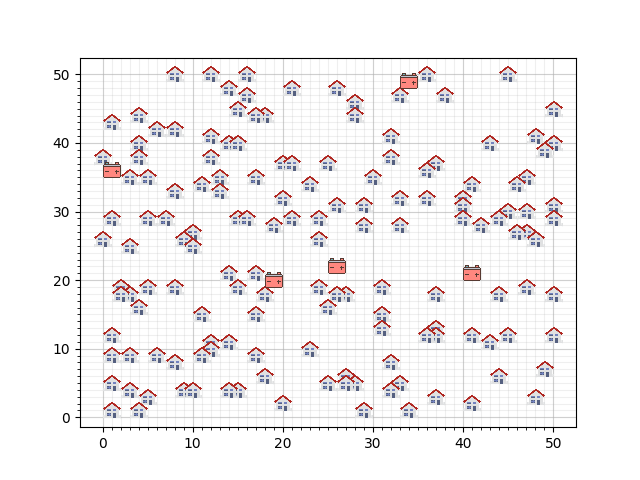

# Case: Smart Grid
{:.inline}

Groene energie is de energie van de toekomst, en zelf produceren is de mode van nu. 
Veel huizen hebben tegenwoordig zonnepanelen, windmolens of andere installaties om zelf energie mee te produceren. 
Fortuinlijk genoeg produceren die installaties vaak meer dan voor eigen consumptie nodig is. 
Het overschot zou kunnen worden terugverkocht aan de leverancier, maar de infrastructuur (het *grid*) is daar veelal niet op berekend. 
Om de pieken in consumptie en produktie te kunnen managen moeten er batterijen geplaatst worden.

**Links:** zeven huizen met zonnepanelen kunnen allemaal op één batterij worden aangesloten. 
Of is (**rechts**) een configuratie van twee batterijen, en minder kabels een goedkoper alternatief?

Voor een feasibility study zijn drie dummy-woonwijken opgesteld, met daarin vijf batterijen. 
De huizen hebben zonnepanelen met een maximale output, de batterijen hebben een maximale capaciteit. 
Exacte data kun je vinden in [deze bestanden](Huizen&Batterijen.zip).

Wijk #1:

Wijk #2:

Wijk #3:

## Opdracht
Houdt tijdens de opdracht rekening met de volgende requirements:
* Batterijen mogen niet aan elkaar verbondenden zijn. Ook niet via een huis.
* Een huis mag niet aan meerdere batterijen verbonden zijn.
* Elk huis heeft een eigen unieke kabel nodig naar de batterij.
* Er mogen meerdere kabels over dezelfde gridsegmenten lopen. Het blijven echter wel unieke kabels en leveren geen kostenvermindering op.

1. Verbind alle huizen in de eerste wijk aan een batterij. De maximumcapaciteit van de huizen mag die van de batterijen uiteraard niet overschrijden.

De batterijen kosten 5000 per stuk. De kabels kosten 9 per grid-segment. 
De kabels liggen op de gridlijnen, mogen ook gridpunten met een huis passeren, en de afstand van een huis tot een batterij wordt berekend volgens de Manhattan distance.

{:start="2"}
2. Bereken de kosten voor de in 1. geconfigureerde wijken. Probeer je SmartGrid te optimaliseren en vind een zo goed mogelijke configuratie van kabels.

Een nieuwe ontwikkeling in het kabelnetwerk biedt de mogelijkheid om meerdere huizen via een kabel aan een baterij te verbinden. 
Vanaf nu geldt de volgende requirement:

* Huizen mogen via eenzelfde kabel aan een batterij verbonden zijn. Ze mogen dus een kabel delen.

{:start="3"}
2. Verbind alle huizen in de drie wijken aan een batterij. De maximumcapaciteit van de huizen mag die van de batterijen uiteraard niet overschrijden.

3. Optimaliseer het smartGrid voor de drie wijken.

## Advanced  
Nu is het zo, dat de batterijen misschien niet op de best mogelijke plaatsen staan. 
Het verplaatsen van batterijen vercompliceert de zaak enorm, maar de opdrachtgever wil het toch proberen, om inzicht in het probleem te krijgen.

{:start="4"}
3. Verplaats de batterijen, en probeer een beter resultaat te realiseren.

Het bedrijf SmartBatteryCompany heeft recentelijk drie types batterijen ontwikkeld, met verschillende capaciteiten en verschillende prijzen.

|Batterijtype | Capaciteit | Prijs |
| --- | --- | --- |
| PowerStar | 450 | 900 |
| Imerse-II | 900 | 1350 |
| Imerse-III | 1800 | 1800 |

{:start="4"}

4. Probeer een betere configuratie voor de wijken te vinden met deze batterijen. Je mag er zoveel gebruiken als je wil en kunnen op ieder gridpunt zonder huis geplaatst worden.

## Output
Om resultaten te kunnen verifiëren is het handig om in een uniform format je output te genereren.
Bekijk [het voorbeeld](example_output.json) (3 huizen over 2 batterijen verdeeld) en zorg ervoor dat jouw programma een oplossing in hetzelfde format kan omzetten.
Let op dat 1 van de huizen is aangesloten op een reeds bestaande kabel van een ander huis.
Zie ook dat het eerste object in de lijst aangeeft voor welke wijk het een oplossing is, en hoe de kosten berekend moeten worden. 
Zorg dat het eerste object in jouw output ook in dezelfde format is. 
De waarde van `district` moet `1`, `2` of `3` zijn. 
Het tweede item is `own-costs` of `shared-costs`, afhankelijk van of de kabels _niet_ of _wel_ gedeeld worden.
Deze is gevolgd door de totale kosten van je oplossing.
N.B. Je programma hoeft hier verder niets mee te doen. Het programma hoeft dit enkel als laatste stap in het process te kunnen doen.

## Check50
Je kan je programma's testen door de output mee te geven aan de check50. Dit kan in drie eenvoudige stappen:
1. Genereer een antwoord en sla deze met het bovenstaande formaat op in een nieuw bestand met de naam `output.json`
2. Open een terminal in de folder waar je `output.json` hebt opgeslagen
3. Run het commando `check50 okkevaneck/check50_heuristieken/master/smartgrid`

## Links & Trivia
De eerste versie van deze case is in juni 2017 ontwikkeld door Jasper Bakker en Stijn Verdenius in het kader van Advanced Heuristics. Het oorspronkelijke idee kwam van oud-heuristiekenstudent Alex Wittebrood.
