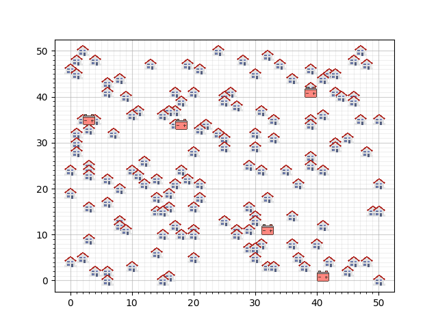

## Inleiding

**Links:** zeven huizen met zonnepanelen kunnen allemaal op één batterij worden aangesloten. Of is (**rechts**) een configuratie van twee batterijen, en minder kabels een goedkoper alternatief? 

Groene energie is de energie van de toekomst, en zelf produceren is de mode van nu. Veel huizen hebben tegenwoordig zonnepanelen, windmolens of andere installaties om zelf energie mee te produceren. Fortuinlijk genoeg produceren die installaties vaak meer dan voor eigen consumptie nodig is. Het overschot zou kunnen worden terugverkocht aan de leverancier, maar de infrastructuur (het *grid*) is daar veelal niet op berekend. Om de pieken in consumptie en produktie te kunnen managen moeten er batterijen geplaatst worden.

Voor een feasibility study zijn drie dummy-woonwijken opgesteld, met daarin vijf batterijen. De huizen hebben zonnepanelen met een maximale output, de batterijen hebben een maximale capaciteit. Exacte data kun je vinden in [deze bestanden](Huizen&Batterijen.zip).

 Wijk #1
 Wijk #2
 Wijk #3

## Opdracht

1. Verbind alle huizen in de drie wijken aan een batterij. De maximumcapaciteit van de huizen mag die van de batterijen uiteraard niet overschrijden.

De batterijen kosten 5000 per stuk. De kabels kosten 9 per grid-segment. De kabels liggen op de gridlijnen, mogen ook gridpunten met een huis passeren, en de afstand van een huis tot een batterij wordt berekend volgens de manhattan distance.

{:start="2"}

2. Bereken de kosten voor de in 1. geconfigureerde wijk. Probeer je SmartGrid te optimaliseren en vind een zo goed mogelijke configuratie van kabels.

3. Optimaliseer het smartGrid voor de drie wijken.

## Advanced  

Nu is het zo, dat de batterijen misschien niet op de best mogelijke plaatsen staan. Het verplaatsen van batterijen vercompliceert de zaak enorm, maar de opdrachtgever wil het toch proberen, om inzicht in het probleem te krijgen.

{:start="3"}
3. Verplaats de batterijen, en probeer een beter resultaat te realiseren.

Het bedrijf SmartBatteryCompany heeft recentelijk drie types batterijen ontwikkeld, met verschillende capaciteiten en verschillende prijzen.

|Batterijtype | Capaciteit | Prijs |
| --- | --- | --- |
| PowerStar | 450 | 900 |
| Imerse-II | 900 | 1350 |
| Imerse-III | 1800 | 1800 |

{:start="4"}

4. Probeer een betere configuratie voor de wijken te vinden met deze batterijen, je mag er zoveel gebruiken als je wil en kunnen op ieder gridpunt zonder huis geplaatst worden.

## Output

Om resultaten te kunnen verifiëren is het handig om in een uniform format je output te genereren. 
Bekijk [het voorbeeld](example_output.csv) (3 huizen over 2 batterijen verdeeld) en zorg ervoor dat jouw programma een oplossing in hetzelfde format kan omzetten.
Let op dat 1 van de huizen is aangesloten op een reeds bestaande kabel van een ander huis.
N.B. Je programma hoeft hier verder niets mee te doen. Het programma hoeft dit enkel als laatste stap in het process te kunnen doen.

## Questions & Answers

Deze questions & answers dienen ter verduidelijking van de case.

**1) Mogen batterijen aan elkaar verbonden zijn?** 

Nee, ook niet via een huis.

**2) Mogen huizen aan elkaar verbonden zijn?**

Ja. Huizen mogen worden aangesloten aan een batterij via een kabel waarmee al een of meerdere huizen zijn aangesloten aan die batterij. 

**3) Mag een huis aan meerdere batterijen verbonden zijn?** 

Nee.

**4) Mogen kabels van verschillende batterijen over het hetzelfde gridpunt of gridsegment lopen?**

Ja. Functioneel blijven de kabels gescheiden en er is geen kostenvermindering. Dit voorkomt kortsluiting. Als je een visuele representatie maakt is het verstandig om ze uit elkaar te kunnen houden, bijvoorbeeld met kleuren, zodat je in geval van kruisende kabels goed kunt volgen welke kabel waarheen loopt.

**5) Is er een huis dubbel genoteerd in één van de csv-bestanden?**

Nee, sinds de update van 17 Oktober 2018 (hopelijk) niet meer.

## Links & Trivia

De eerste versie van deze case is in juni 2017 ontwikkeld door Jasper Bakker en Stijn Verdenius in het kader van Advanced Heuristics. Het oorspronkelijke idee kwam van oud-heuristiekenstudent Alex Wittebrood.
