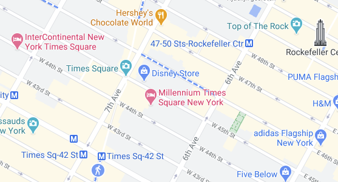

# State-space

Om je case beter te begrijpen en een idee te hebben hoe “groot” het probleem is, is het goed om een schatting te hebben van de grootte van de state-space van je case. Daarmee bedoelen we het aantal mogelijke geldige staten die mogelijk zijn in de case, of het aantal mogelijke geldige oplossingen van de case.

Bijvoorbeeld, in een case waar we de beste rij moeten vinden zijn dit de mogelijkheden waarop Anna, Bert en Carlijn in een rij kunnen staan:
(ABC, ACB, BAC, CAB, BCA, CBA). Zo zie je dat er zes mogelijkheden zijn. Ook kan je dit berekenen, want Anna kan op drie verschillende plekken staan, na die keuze gemaakt te hebben kan vervolgens Bert op de overige twee plekken staan en tot slot Carlijn op de laatste plek. Vermeningvuldig je dit met elkaar, dus `3 x 2 x 1` dan krijg je het aantal mogelijkheden: `6` ofwel `3!`

Soms is het erg moeilijk om exact de grootte van de state-space te berekenen. Daarom doen we soms aannames om deze berekening te versimpelen. Deze aannames kiezen we dan wel zo zodat we zeker weten dat het werkelijke aantal mogelijk staten hier gegarandeerd niet boven ligt. We noemen dit een bovengrens (upper-bound) van de grootte van de state-space. Hoe lager de bovengrens hoe beter.

## Combinaties en Permutaties

Om de grootte van de state-space te berekening is het nuttig om bekend te zijn met Combinaties en Permutaties. [Lees hier over Combinaties en Permutaties](https://www.mathsisfun.com/combinatorics/combinations-permutations.html)

Er zijn eigenlijk twee belangrijke aspecten om op te letten bij de berekening:

1. Order: Is de volgorde belangrijk?
1. Repetition: Kan ik herhaaldelijk dezelfde keuze maken?

Op basis van deze twee aspecten vind je hieronder een kleine cheatsheet voor de berekening:

Vaak helpt het om een probleem eerst te verkleinen en het dus eerst voor zeer kleine waarden voor ‘n’ en ’r’ op te lossen waarbij je nog kunt natellen of het antwoord klopt.

## Opdrachten

Stel jezelf bij ieder van de opdrachten hieronder de volgende vragen:

* Is de volgorde belangrijk?
* Kan ik herhaaldelijk dezelfde keuze maken?

Geef bij iedere opdracht zowel de formule als de uitkomst.

### Opdracht 1

Een student heeft 12 verschillende vakken van 2 uur welke geroosterd moeten worden van maandag t/m vrijdag in tijdsloten 9-11, 11-13, 13-15, 15-17. Hoeveel verschillende roosters zijn er mogelijk voor deze student zonder overlap van vakken?

<textarea name="form[q1]" rows="2" required></textarea>

### Opdracht 2

Je fietst door Manhattan, New York en kunt bij elk kruispunt linksaf, rechtsaf of rechtdoor. Hoeveel verschillende routes kun je rijden vanaf een gegeven beginpunt en richting met daarin 20 kruispunten?

<textarea name="form[q2]" rows="2" required></textarea>

### Opdracht 3

Er moeten 50 dozen met flesjes water, 50 dozen fruit, en 30 dozen boordjes worden vervoerd. In de bestelbus passen 25 dozen. Hoeveel verschillende ladingen kun je in de eerste ritje meenemen als je een volle lading meeneemt?

<textarea name="form[q3]" rows="2" required></textarea>

### Opdracht 4

Om af te studeren moet een student 30 vakken hebben afgerond, maar een student mag er ook meer doen. Een student kan daarbij kiezen uit 110 verschillende aangeboden vakken. Op hoeveel verschillende manieren kan een student afstuderen met 30, 31 of 32 vakken?

<textarea name="form[q4]" rows="2" required></textarea>

### Opdracht 5

Een loterij heeft balletjes A t/m Z waaruit een notaris op volgorde 7 willekeurige balletjes trekt zonder terugleggen. Wat is de kans dat het lot met DBFAECG wint?

<textarea name="form[q5]" rows="2" required></textarea>

### Opdracht 6

Opnieuw moeten 50 dozen met flesjes water, 50 dozen fruit, en 30 dozen boordjes worden vervoerd. Je hebt nu een vrachtwagen waarin 45 dozen passen. Hoeveel verschillende ladingen kun je nu in de eerste ritje meenemen als je een volle lading meeneemt?

<textarea name="form[q6]" rows="2" required></textarea>

### Opdracht 7

Geef (de bovengrens van) de grootte van de state-space van de gekozen case.

Welke case heb je gekozen?

<textarea name="form[q7]" rows="1" required></textarea>

Welke variabelen zijn er in de case?

<textarea name="form[q8]" rows="4" required></textarea>

Beschrijf de eventuele versimpelende aannames die je maakt en waarom de werkelijke state-space grootte hier dan gegarandeerd nooit boven ligt.

<textarea name="form[q9]" rows="4" required></textarea>

Geef de formule voor de berekening van (de bovengrens van) de grootte van de state-space van je case.

<textarea name="form[q10]" rows="2" required></textarea>

Laat in een klein voorbeeld zien dat de formule klopt door bijvoorbeeld alle staten op te sommen.

<textarea name="form[q11]" rows="4" required></textarea>

Bereken de grootte van de state-space voor één of meer van de probleem-instanties in de case.

<textarea name="form[q12]" rows="4" required></textarea>